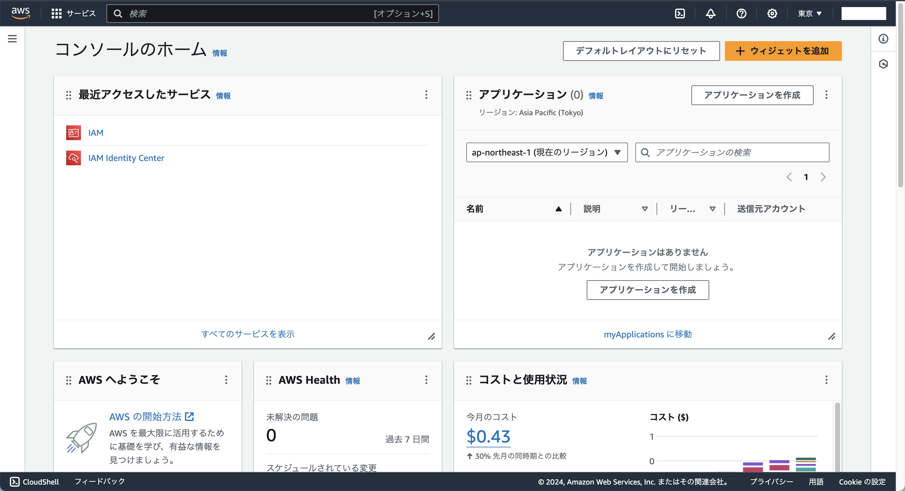
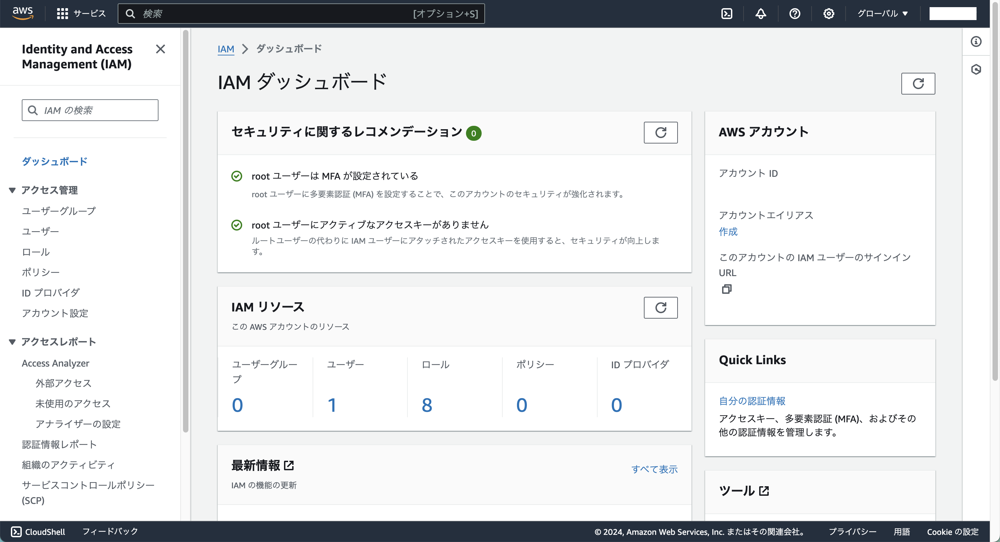
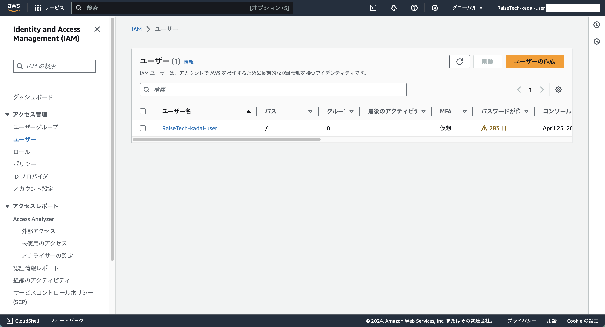
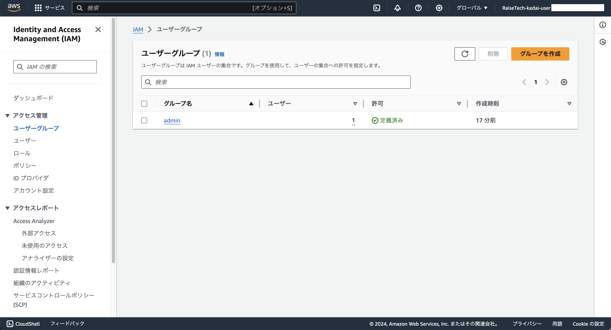
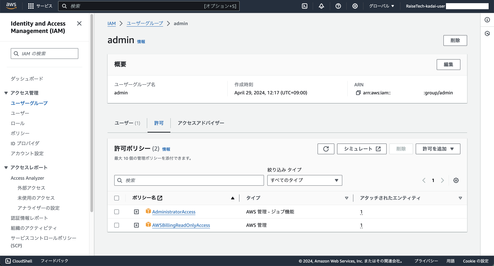
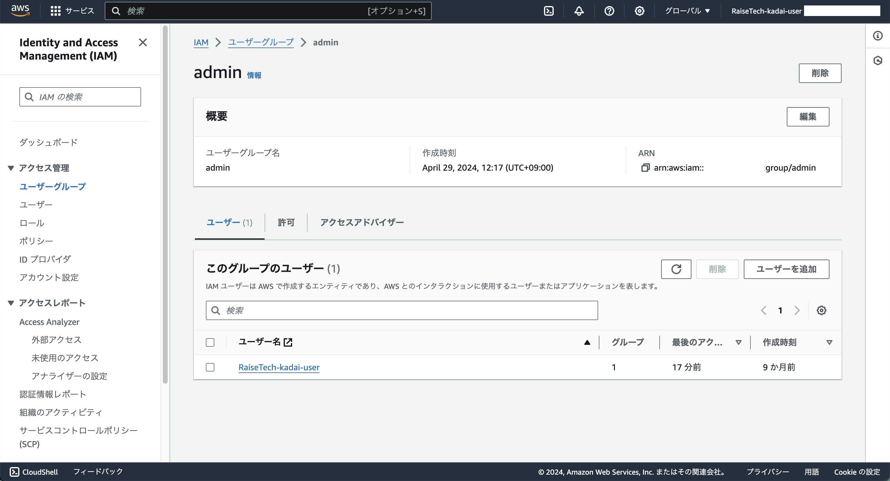
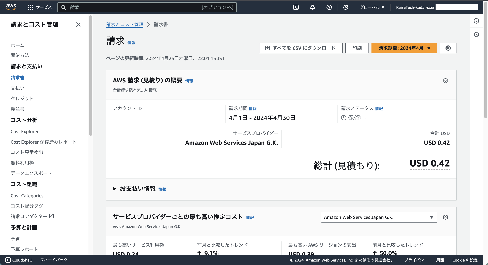
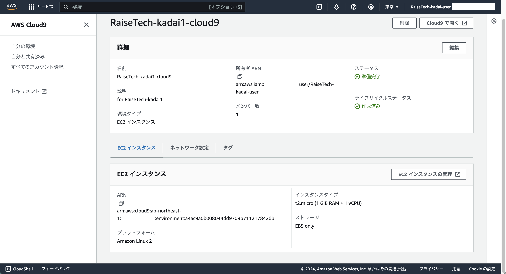
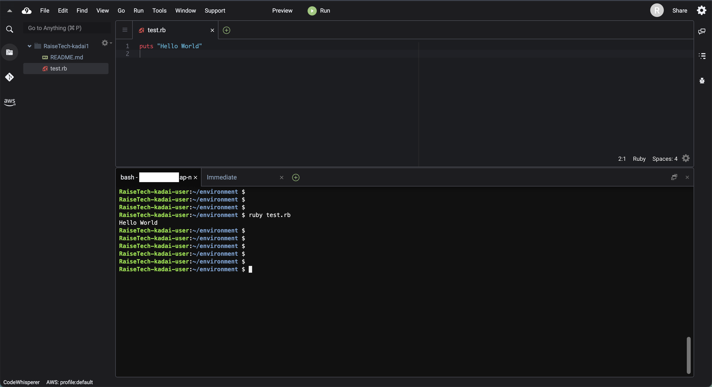

## 1. AWSアカウントの作成
- 作成済み
  

## 2. IAMの推奨設定
- **rootユーザ**をMFAで保護

---
- **AdministratorAccess**権限の**IAMユーザー**を作成
- **Billing**を**IAMユーザ**で閲覧出来るように
  - **admin**権限のグループを作成し、ポリシーを割り当てた後、ユーザーをグループに所属させる
    - 作成したIAMユーザ
      

    - 作成したIAMグループ
      

    - 作成したIAMグループに2つ権限を割り当てる
      - **AdministratorAccess**権限を付与
      - **AWSBillingReadOnlyAccess**権限を付与
        

    - グループにユーザーを所属させる
      

  - Billing and Cost Managementコンソール画面を表示
    

## 3. Cloud9の作成
- **Amazon Linux 2**で作成

---

- コンソール画面に**HellWorld**を出力

