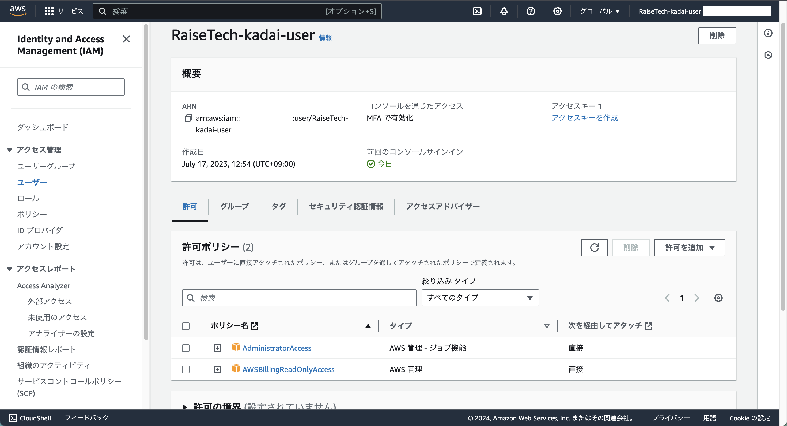

## 1. AWSアカウントの作成

## 2. IAMの推奨設定
- **rootユーザ**をMFAで保護

---
- **AdministratorAccess**権限の**IAMユーザー**を作成
  - 作成したIAMユーザ
  
  - AdministratorAccess権限を付与
  
---
- **Billing**を**IAMユーザ**で閲覧出来るように
  - AWSBillingReadOnlyAccess権限を付与
  
  - Billing and Cost Managementコンソール画面を表示
  

## 3. Cloud9の作成
- **Amazon Linux 2**で作成

- コンソール画面に**HellWorld**を出力

