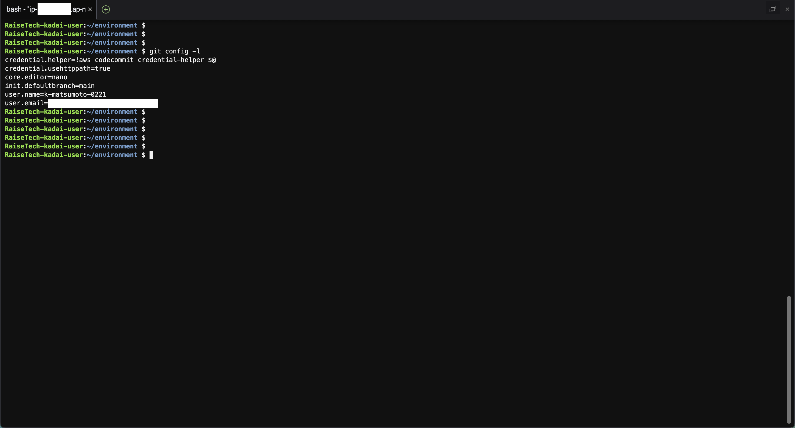
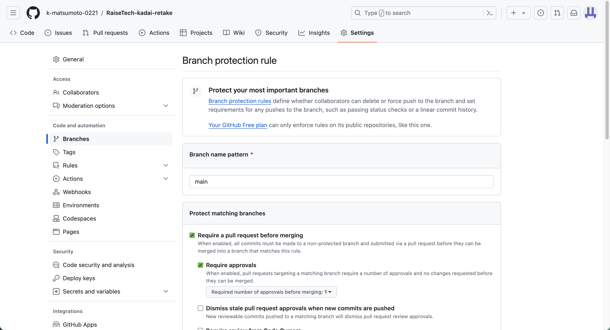

## 1. GitHubアカウントの作成
- 作成済み


## 2. Cloud9のGit設定変更
- Cloud9の作成


-  新規リポジトリのデフォルトブランチ名を **main** に変更
- ユーザー名とメールアドレスを変更
  - 実行コマンド
    ```bash:title
    $ git config --global init.defaultBranch main
    $ git config --global user.name "ユーザー名"
    $ git config --global user.email "メールアドレス"
    ```

  - 実行結果
    

## 3. Pull Request の練習
- 実施内容は [こちら](practice.md) に記載

## 4. 課題用リポジトリ作成と設定変更
- GitHub でリポジトリを **Public（公開設定）** で作成
  - 作成済み
  
  
- **main** ブランチに**ブランチ保護ルール** をつける
  - Pull Request 必須
  - 承認を要求（必要承認回数は 1 で）
    - [こちら](https://qiita.com/KeisukeKudo/items/6404f51d1f4407661321) を参考に設定

    1. 対象のリモートリポジトリから「 Settings 」をクリック
    2. 左ペインから「 Branches 」をクリック
    3. 「 Add branch protection rule 」をクリック
    4. 以下を設定
        - Branch name pattern
        - Require a pull request before merging
          
    5. 「 Create 」をクリック
      

## 5. Pull Request の発行と完了報告
- 「ブランチ: lecture02 」を作成して、今日の講座を聞いて感じたことを「 lecture02.md 」に Markdown で書き、 Pull Request を発行すること
  - 講座を聞いて感じたこと
    - デフォルトブランチ名が master ⇒ main に変わった背景を知ることができて面白いなと感じました。
    - 今回の講座をきっかけにマークダウンを知ることができました。普段の業務でも利用するようにしていますが、簡単に文字の装飾ができて便利だと感じることがあります。
    - ブランチの保護ルール の設定方法を学ぶことができました。

- レビューしてくれた人の GitHub ID をリポジトリの Collaborator に設定
  - 設定済み
  

## <font color="Red">禁止事項</font>
- 今後課題を進める上でやってはいけないことを記載しておく
  1. 指摘の修正を理由として独断で Pull Request を新しく作り直す
  2. レビュアーの許可なしに自分で Pull Request をマージする
