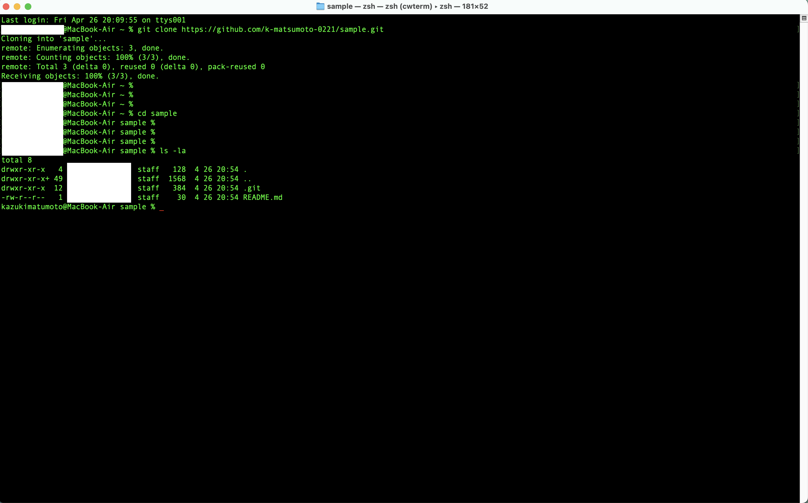

## 1. GitHub のアカウント作成<br>2. Git の初期設定
- 省略

## 3. GitHub 個人アクセストークンの作成
- 手順
    1. [Settings](https://github.com/settings/apps)
    から**Fine-grained personal tokens**をクリック
    2. **Generate new token**をクリック
    3. 各パラメータを入力
        - \* が必須パラメータ
        - All repositories を選択すること
    4. **Generate token** をクリック
    

## 4. GitHub のリポジトリ作成
- sample を作成
- **add a README file** にチェックを入れること
- public/private のどちらもでも良い


## 5. GitHub リポジトリのクローン
1. ローカルPC へクローン
    ```bash:title
    % git clone https:// 省略
    ```
2. sample に cd してクローンできているか確認


## 6. 作業用ブランチの作成と現在ブランチの切替（checkout）
- ブランチ作成/移動
    ```bash:title
    % git checkout -b git-lecture
    ```
- ブランチが作成されているか確認
    ```bash:title
    % git branch
    ```
    

## 7. ファイルの作成・変更
- **git-lecture.md** の名前で Markdown ファイルを作成

## 8. ファイルのステージング(add)
- **git-lecture.md** をステージング
    ```bash:title
    % git add git-lecture.md
    ```
- ステージングされているか確認
    ```bash:title
    % git status
    ```
    

## 9. ファイルのコミット
- **git-lecture.md** をコミット
    - コミットメッセージについては指定されたものを使用
    ```bash:title
    % git commit -m "add git-lecture.md"
    ```
- コミットされたか確認
    ```bash:title
    % git status
    ```
    

## 10. ステージング情報のプッシュ
- **git-lecture.md** をリモートリポジトリ（GitHub）へプッシュ
    ```bash:title
    % git push origin git-lecture
    ```
    
- リモートリポジトリを確認


## 11. プルリクエスト（PR）
- プルリクエストを作成


## 12. プルリクエスト（PR）のマージ（ブランチ統合）
- 内容に問題がなければマージを行う
- main ブランチへマージ
    1. Merge Pull request をクリック
    2. confirm merge をクリック

## 13. main ブランチでのマージ結果の確認
- 一つ前の手順でリモートリポジトリには反映されていることが確認できている
- ローカルリポジトリ に変更結果を反映する
    - 実行コマンド
        ```bash:title
        % git pull
        ```
    - 実行結果
    
    

## 14. 不要になったブランチの削除
- ローカルリポジトリから不要なブランチを削除
    ```bash:title
    % git branch -d git-lecture
    ```
    
- リモートリポジトリから不要なブランチを削除
    - 省略

## 15. 完了
- 業務で使用していることもあって、スムーズにできたと思います。
- 改めて一つ一つ丁寧に手順を追ってみたことでより理解が深まったように感じました。
- ブランチの移動は今後、 **git switch** を利用していきたいなと思いました。
