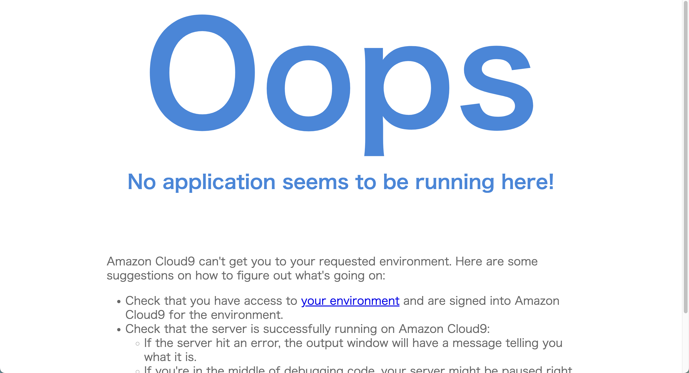
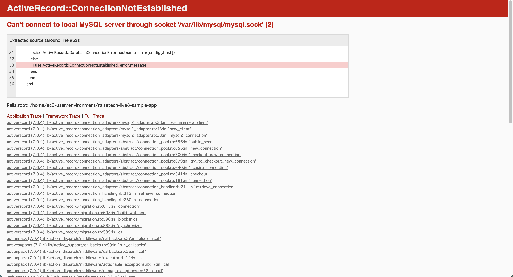

## 0. サンプルアプリケーションをデプロイ
  - [procedure.md](./procedure.md)	に手順を記載
  - サンプルアプリケーションを起動した際のログは [こちら](./log/applicationLaunch.log)	

## 1. AP サーバーについて調べる
  - AP サーバーの名前とバージョンを調べる
    - Puma
    - 5.6.5

  - AP サーバーを終了させた場合、引き続きアクセスできるか確認
    - 以下のようなページが表示され、アクセス不可
    - 

  - その後、AP サーバーを起動する

## 2. DB サーバーについて調べる
  - DB サーバー (DBエンジン) の名前を調べる
    - MySQL

  - Cloud9 上で動作させているバージョンを調べる
    - 8.0.37
    ```bash:title
    $ mysql -u root -p
    > select version();
    > exit
    ```

  - DB サーバーを終了させた場合、引き続きアクセスできるか確認
    - 以下のコマンドを実行
      ```bash:title
      $ sudo service mysqld stop
      $ sudo service mysqld status
      ```
      - 以下のようなページが表示され、アクセス不可
      - 

    - DB サーバーを再起動後、アクセスできることを確認

  - Rails の構成管理ツールの名前を調べる
    - Bundler

## 3. 感想
  - 自分が実際に行った操作を細かく記録していったことによって、これまであやふやになっていた部分の理解が深まったように感じました。
  - 様々なパッケージ管理ツールに触れたことで、パッケージのバージョン合わせがスムーズに行えるようになりました。
  - システム開発（構築）手法について、理解が深まったように感じました。
