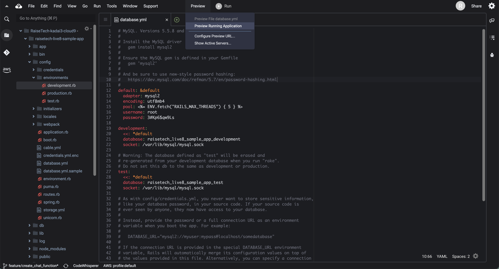
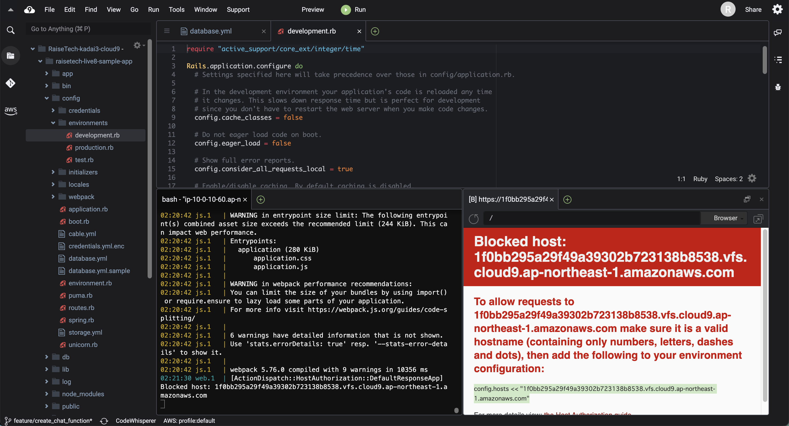
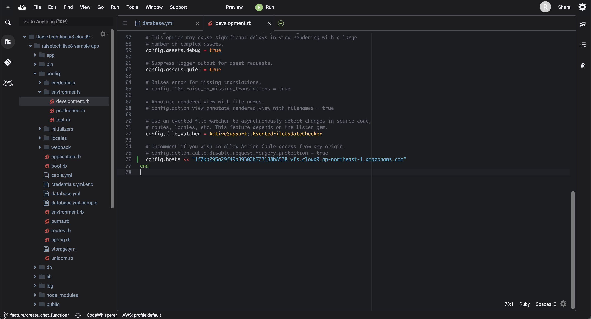
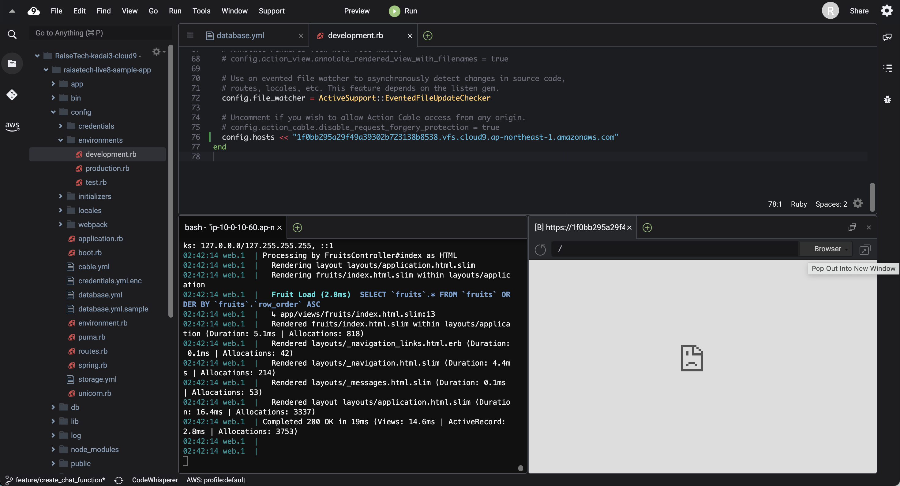
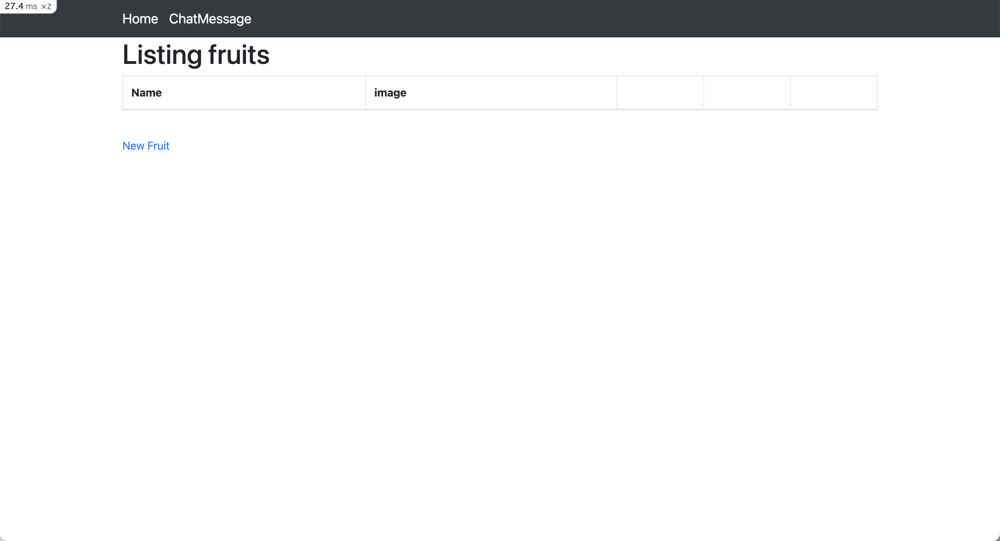

## 環境
- ruby
  - 3.1.2
- Bundler
  - 2.3.14
- Rails
  - 7.0.4
- Node
  - v17.9.1
- yarn
  - 1.22.19
- DB エンジン
  - MySQL

- 環境構築はターミナルで以下のコマンドを実行すること
  ```bash:title
  $ bin/setup
  ```
- rails サーバーの起動は以下のコマンドを実行すること
  ```bash:title
  $ bin/cloud9_dev
  ```

## 手順 
1. **ruby** のインストール
    - **rvm** を使用し、バージョンを合わせる
    ```bash:title
    $ rvm get head
    $ rvm install 3.1.2
    $ ruby -v
    ```

2. **Bundler** のインストール
    - バージョンを合わせる
    ```bash:title
    $ gem search ^bundler$ --all | grep 2.3.14
    $ gem install bundler -v 2.3.14
    $ bundler -v
    ```

3. **Rails** のインストール
    - バージョンを指定して、インストール
    ```bash:title
    $ gem install rails -v 7.0.4
    $ rails -v
    ```


4. **Node** のインストール
    - **nvm** を使用し、バージョンを合わせる
    ```bash:title
    $ nvm ls-remote
    $ nvm install v17.9.1
    $ node -v
    ```

5. **yarn** のインストール
    - **npm** を使用し、インストール。バージョンを合わせる
    ```bash:title
    $ npm install -g yarn
    $ yarn set version 1.22.19
    $ yarn -v
    ```

6. サンプルアプリケーションをクローン
    - ブランチは **feature/create_chat_function** を使用
    ```bash:title
    $ git clone -b feature/create_chat_function https://github.com/yuta-ushijima/raisetech-live8-sample-app.git
    ```

7. DBの構築/設定
    - [こちら](https://github.com/MasatoshiMizumoto/raisetech_documents/blob/main/aws/docs/install_mysql_on_cloud9_amazon_linux_2.md)
        を参考に以下 4つ を実施
        - ディスク容量を確保
        - MySQLのインストール
        - 初期パスワードの入手＆動作確認
        - パスワードの変更
    
    - config ファイルを作成
      ```bash:title
      $ cd raisetech-live8-sample-app/
      $ cp -p ./config/database.yml.sample ./config/database.yml
      ```

    - config ファイルを修正
      - ./config/database.yml
        1. **password** を修正
            - default
        2. **socket** を修正
            - development
            - test
              - 以下のコマンドで調べられる
                ```bash:title
                $ mysql_config --socket
                ```

8. 環境構築  
    - 以下のコマンドを実行
      ```bash:title
      $ bin/setup
      ```
    - アプリケーションを一時的に起動
      ```bash:title
      $ sudo chmod 755 bin/cloud9_dev
      $ bin/cloud9_dev
      ```

    - **development.rb** を修正
      1. 上ペインから 「Preview」 - 「Preview Running Application」 をクリック
        
      2. 右下に以下のウィンドウが出てくるため、カーソル上の文字列をコピー
        
      3. **./environments/development.rb** の**end** の上に貼り付け
        

    - アプリケーションを停止
      - コンソール画面にて、「ctrl + c」

9. アプリケーションの起動
    - 以下のコマンドを実行
      ```bash:title
      $ bin/cloud9_dev
      ```

    - 右下のウィンドウから 「Pop Out Into New Window」 をクリック  
        <font color="Red">※アプリケーションが起動するまで待ってからクリックすること</font>
        
    
    - ブラウザ上に以下のウィンドウが表示されれば良い
        
