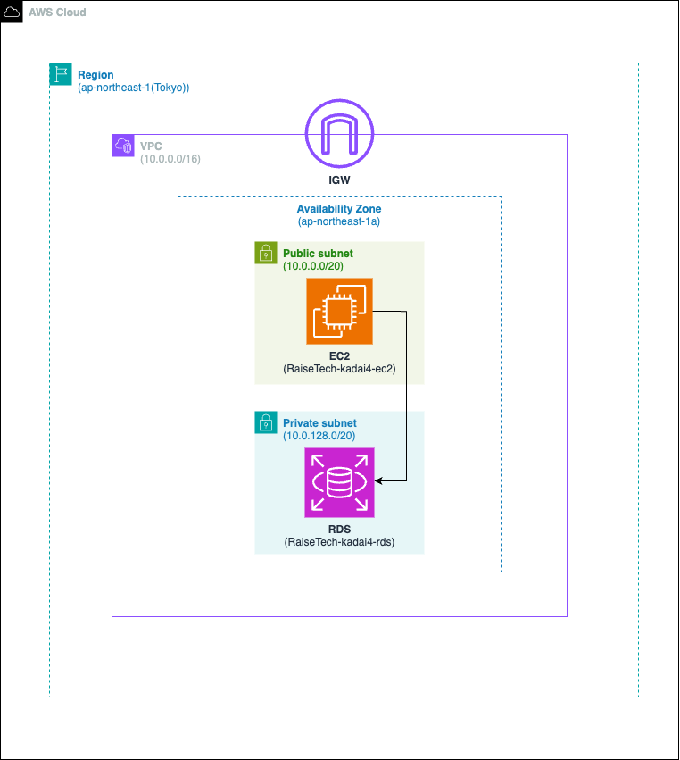

## 0. 目的
- **VPC** を作成
- **EC2** と **RDS** を構築
- **EC2** から **RDS** へ接続をし、正常であることを確認して、GitHub で報告

## 1. 環境
- 作成する物
  - NetworkLayer
    - VPC
      - サブネット
        - パブリックサブネット \* 1
        - プライベートサブネット \* 1
      - ルートテーブル
      - インターネットゲートウェイ
  - ApplicationLayer
    - EC2
      - Amazon Linux 2
      - MySQL クライアント
    - RDS
      - MySQL
  - SecurityLayer
    - セキュリティグループ
      - EC2 用
      - RDS 用

- 環境構成図  


## 2. VPC を作成
- 構築した手順は [こちら](./procedure/VPC.md)	に記載

    - 画像1
    

    - 画像2
    

## 3. セキュリティグループを作成
- **EC2** と **RDS** に割り当てるため、2 種類作成する
- 構築した手順は [こちら](./procedure/セキュリティグループ.md) に記載

    - EC2 用
      - インバウンドルール
      

      - アウトバウンドルール
      

    - RDS 用
      - インバウンドルール
      

      - アウトバウンドルール
      

## 4. EC2 を作成
- 構築した手順は [こちら](./procedure/EC2.md)	に記載

    - 画像1
    

    - 画像2
    

## 5. RDS を作成
- 構築した手順は [こちら](./procedure/RDS.md)	に記載

    - 画像1
    

    - 画像2
    

## 6. EC2 と RDS を接続
1. 作成した **EC2** に ssh した後、MySQLクライアントをインストール
2. **EC2** から **RDS** へ接続
    - **作業ログ** は [こちら](./log/ConstWork_20240502.log)
    ```bash:title
    $ ssh -i "キーペアのパス" ec2-user@パブリック IPv4 DNS
    $ sudo yum -y install mysql
    $ mysql -h DBエンドポイント -u admin -p
    ```

  
