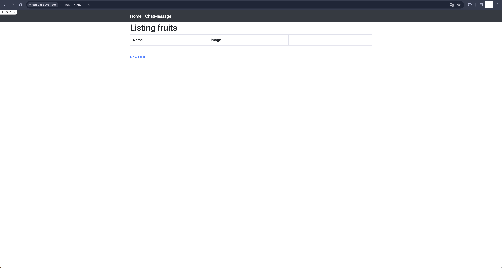
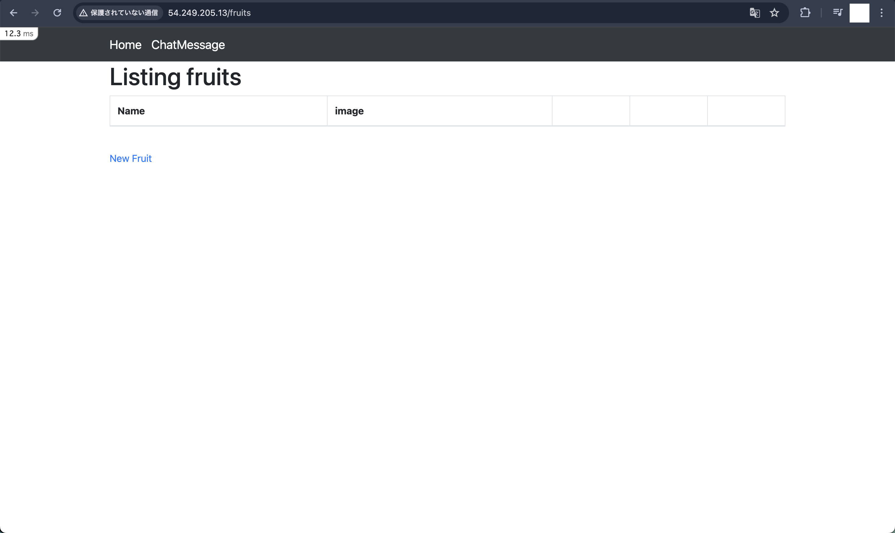
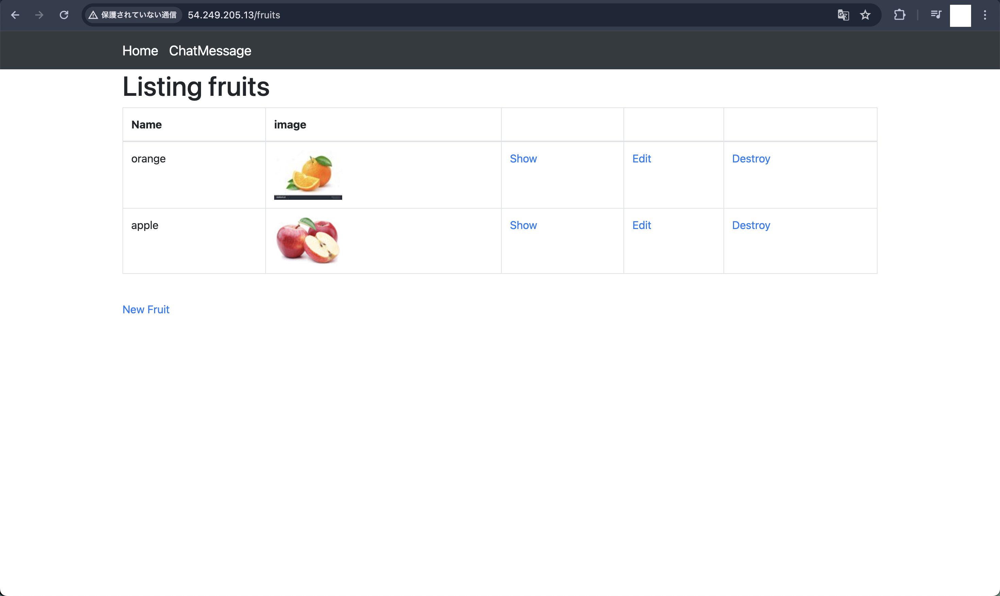
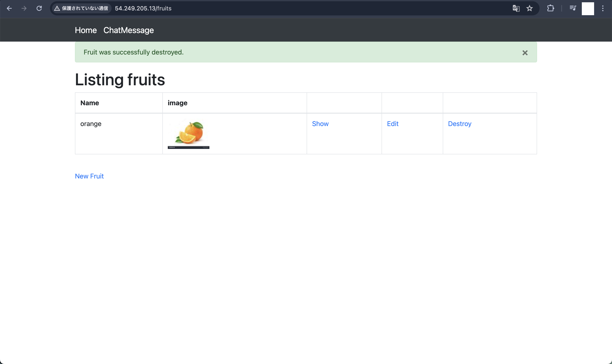
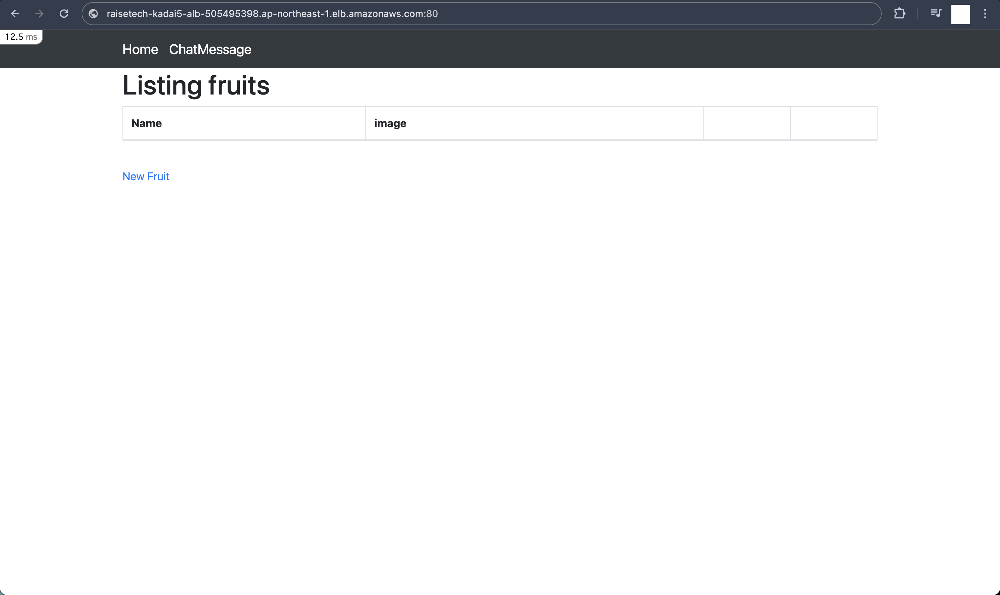
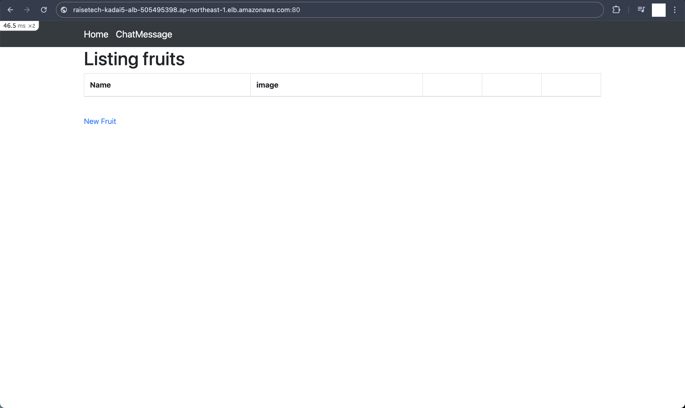
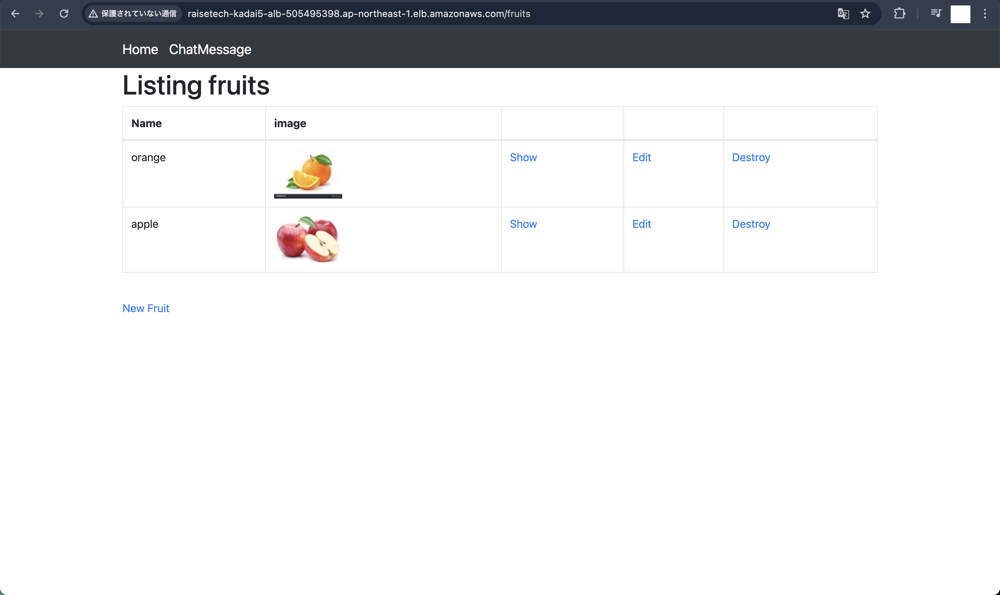
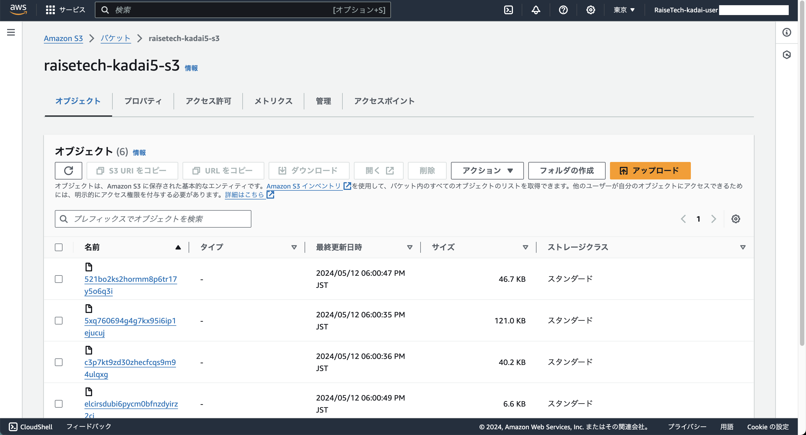
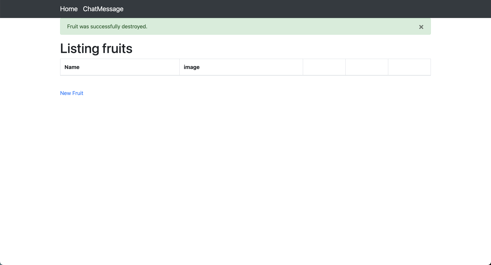
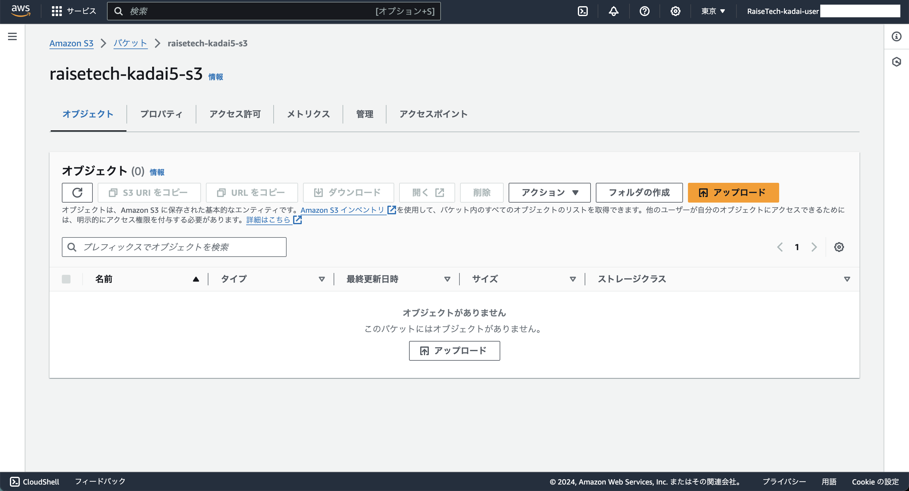

## 0. 目的
- EC2 上にサンプルアプリケーションをデプロイして、動作させる
    - **サンプルは第 3 回で案内済みのものを使用すること**

        1. 組み込みサーバだけで動作確認
        2. Web, AP サーバをそれぞれ分けて動作確認  
            - Webサーバには Nginx、APサーバには Unicorn を使用する
        3. 動作したら、ALB を追加して動作確認
        4. ALB を加えて動作が確認できたら、さらに S3 を追加

- 作成した環境を構成図に書き起こす
- 正しく動作したことを示す資料（画像など）を添えて、GitHub で報告

## 1. 環境
- 作成する物
  - NetworkLayer
    - VPC
      - サブネット
        - パブリックサブネット \* 2
        - プライベートサブネット \* 2
      - ルートテーブル
        - EC2 用
        - RDS 用
        - ALB 用
      - インターネットゲートウェイ
  - ApplicationLayer
    - EC2
      - [必要なパッケージ](./env/environment.md)
    - RDS
      - MySQL
    - ALB
      - ターゲットグループ
    - S3
  - SecurityLayer
    - セキュリティグループ
      - EC2 用
      - RDS 用
      - ALB 用
    - IAM ロール
      - EC2 用

- 環境構成図

## 2. 組み込みサーバだけで動作確認
- EC2 と RDS を作成した後、サンプルアプリケーションを **組み込みサーバ** で動作させる
  - 構築を行なった手順は [こちら](./work/step01/step01.md) に記載
  - 作業ログは [こちら](./work/step01/log/constWork_20240505.log)
- 動作確認
  - 画像1
  

## 3. Web, AP サーバをそれぞれ分けて動作確認
- `2. 組み込みサーバだけで動作確認` で作成した環境に **Nginx** と **Unicorn** を導入して、サンプルアプリケーションを動作させる
  - 構築を行なった手順は [こちら](./work/step02/step02.md) に記載
  - 作業ログは [こちら](./work/step02/log/constWork_20240513.log)
- 動作確認
  - 画像1
  
  - 画像2
  
  - 画像3
  

## 4. ALB を追加して動作確認
- `3. Web, AP サーバをそれぞれ分けて動作確認` で作成した環境に **ALB** を追加して、アプリケーションにアクセスできることを確認する
  - 構築を行なった手順は [こちら](./work/step03/step03.md) に記載
- 動作確認
  - 画像1
  

## 5. ALB を加えて動作が確認できたら、さらに S3 を追加
- `4. ALB を追加して動作確認` で作成した環境に **S3** を追加して、画像の保存先を変更する
  - 構築を行なった手順は [こちら](./work/step04/step04.md) に記載
- 動作確認
  - 画像1
  
  - 画像2
  
  - 画像3
  
  - 画像4
  
  - 画像5
  
