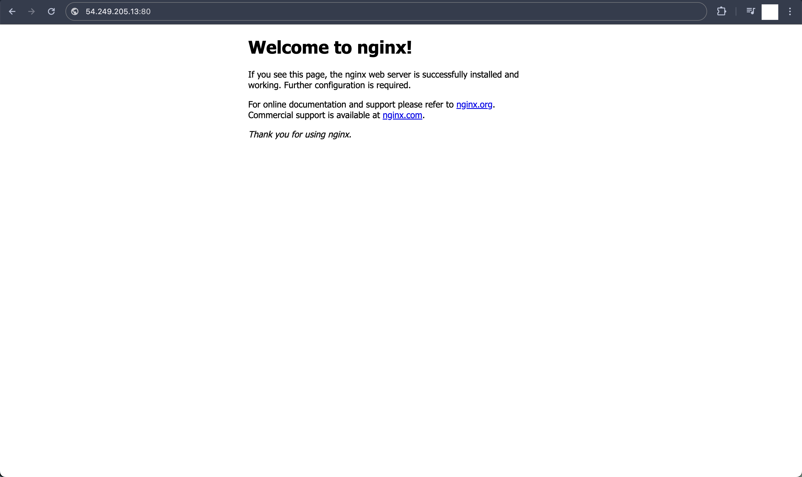

## 手順
### 1. Nginx のインストール
- EC2
  - 以下のコマンドを実行
    ```bash:title
    $ sudo amazon-linux-extras enable nginx1
    $ sudo yum -y install nginx
    $ nginx -v
    $ sudo systemctl enable nginx
    $ sudo systemctl start nginx
    $ sudo systemctl status nginx
    ```
  - Nginx の サンプルページを表示させる
    - ブラウザに **http://EC2グローバルIP:80** を入力
    

### 2. Unicorn のインストール
- EC2
  - インストール済み
    ```bash:title
    $ unicorn -v
    ```

### 3. Nginx と Unicorn の接続設定
- EC2
  - Nginx
    - Nginx を一時停止
      ```bash:title
      $ sudo systemctl stop nginx
      $ sudo systemctl status nginx
      ```
    - サンプルアプリケーション向けに設定ファイルを作成
      - 以下のコマンドを実行
        ```bash:title
        $ sudo vi /etc/nginx/conf.d/raisetech-live8-sample-app.conf
        ```
      - サンプルを参考に **configファイル** を修正
        - [raisetech-live8-sample-app.conf](./conf/raisetech-live8-sample-app.conf)
    - Nginx を起動
      ```bash:title
      $ sudo systemctl start nginx
      $ sudo systemctl status nginx
      ```
  - Unicorn
    - unicorn.rb の修正
      - 以下のコマンドを実行
        ```bash:title
        $ cd /var/www/raisetech-live8-sample-app
        $ cp -p ./config/unicorn.rb ./config/unicorn.rb.org
        $ vi ./config/unicorn.rb
        ```
      - サンプルを参考に **5, 6 行目** を修正
        - [unicorn.rb](./conf/unicorn.rb)
      - 確認
        ```bash:title
        $ diff ./config/unicorn.rb ./config/unicorn.rb.org
        ```

### 4. サンプルアプリケーションを Unicorn で動作させる
- EC2
  - 開発環境で起動
    ```bash:title
    $ bundle exec unicorn_rails -c ./config/unicorn.rb -E development
    ```
  - アプリケーションを停止させる場合
    - コンソール上で **ctrl + c**

### 5. アプリケーションにアクセス
- ブラウザに **http://EC2グローバルIP:80** を入力
