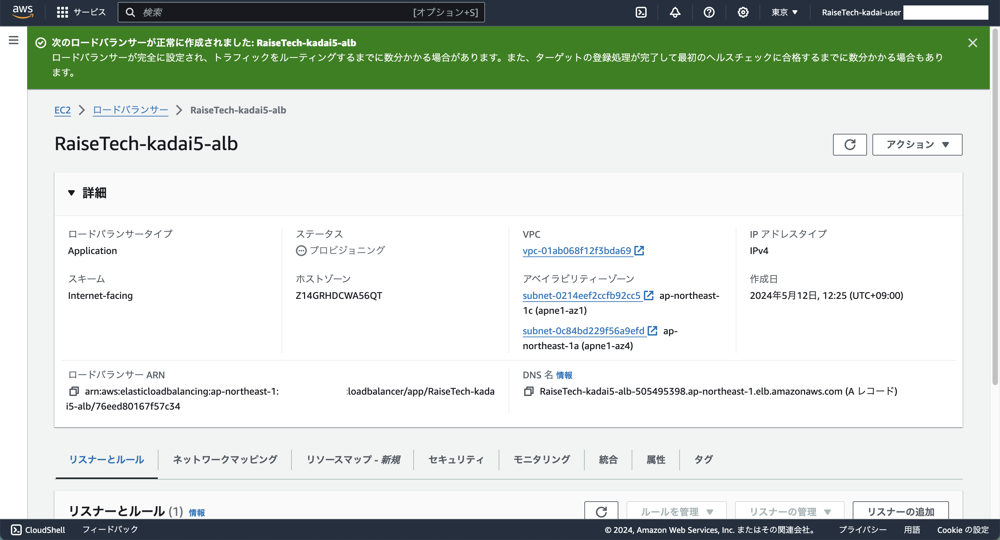

## 手順
### 1. EC2 ダッシュボードへ

### 2. 左ペインから「ロードバランシング」 - 「ロードバランサー」をクリック

### 3. 中央ペインから「ロードバランサーの作成」をクリック  
  - ロードバランサータイプの比較と選択
    - Application Load Balancer
      - 「作成」をクリック

  - Application Load Balancer を作成
    - Elastic Load Balancing の仕組み
      - なし
    - 基本的な設定
      - ロードバランサー名
        - 省略
      - スキーム
        - インターネット向け
      - IP アドレスタイプ
        - IPv4
    - ネットワークマッピング
      - VPC
        - **作成済みのVPC** を選択
      - マッピング
        - **パブリックサブネット** を選択
    - セキュリティグループ
      - セキュリティグループ
        - **作成済みのセキュリティグループ** を選択
    - リスナーとルーティング
      - リスナーHTTP:80
        - プロトコル
          - HTTP
        - ポート
          - 80
        - デフォルトアクション
          - **作成済みのターゲットグループ** を選択
          - 構築した手順は [こちら](./ターゲットグループ.md) に記載
        - リスナータグ - 省略可能
          - 追加しない
      - リスナーの追加はしない
    - ロードバランサー タグ - 省略可能
      - **Name** タグを追加
    - AWS Web Application Firewall (WAF)
      - ロードバランサーの背後に WAF セキュリティ保護を含める
        - チェックしない
    - AWS Global Accelerator
      - アクセラレーターを作成
        - チェックしない
    - 概要
      - なし
    - サーバー側のタスクとステータス
      - なし

### 4. 「ロードバランサーの作成」をクリック
  - 画像1
  
  - 画像2
  
