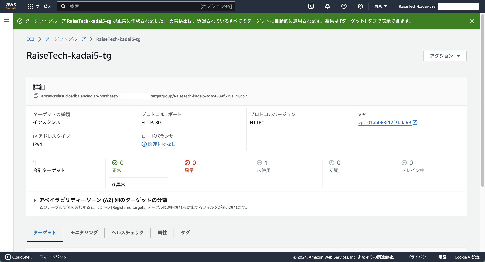
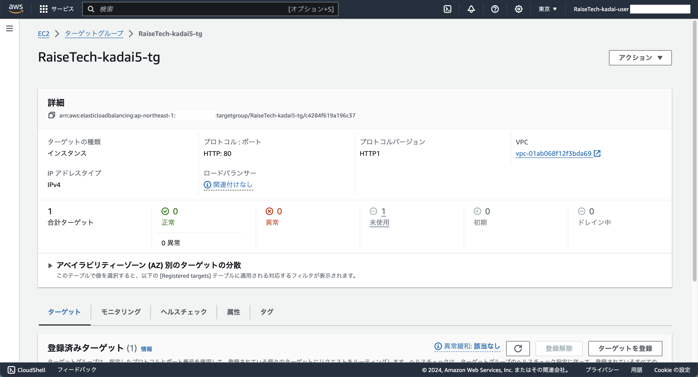

## 手順
### 1. EC2 ダッシュボードへ

### 2. 左ペインから「ロードバランシング」 - 「ターゲットグループ」をクリック

### 3. 中央ペインから「ターゲットグループの作成」をクリック
  - ステップ1：グループの詳細の指定
    - 基本的な設定
      - ターゲットタイプの選択
        - インスタンス
      - ターゲットグループ名
        - 省略
      - プロトコル : ポート
        - HTTP
        - 80
      - IP アドレスタイプ
        - IPv4
      - VPC
        - **作成済みのVPC** を選択
      - プロトコルバージョン
        - HTTP1
    - ヘルスチェック
      - ヘルスチェックプロトコル
        - HTTP
      - ヘルスチェックパス
        - /
      - ヘルスチェックの詳細設定  
        - ヘルスチェックポート
          - トラフィックポート
        - 正常のしきい値
          - 2
        - 非正常のしきい値
          - 2
        - タイムアウト
          - 2
        - 間隔
          - 5
        - 成功コード
          - 200
    - 属性
      - なし
    - タグ - 省略可能
      - **Name** タグを追加

### 4. 「次へ」をクリック
  - ステップ2：ターゲットを登録
    1. **使用可能なインスタンス** 欄から **作成済みのEC2インスタンス** にチェックを入れる
    2. 「保留中として以下を含める」をクリック
    3. **ターゲットを確認** 欄に上記の手順でチェックを入れたEC2インスタンスが含まれているか確認

### 5. 「ターゲットグループの作成」をクリック
  - 画像1
  
  - 画像2
  
