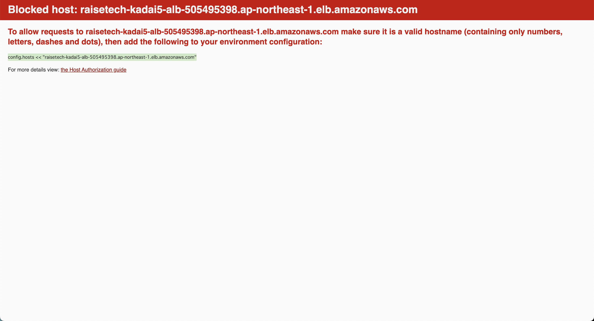
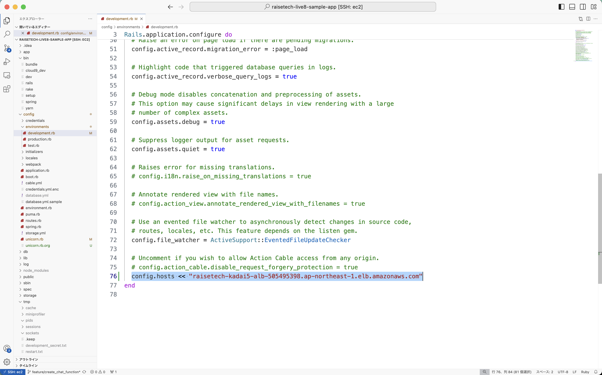

## 手順
### 1. ALB と ターゲットグループ を作成
- **AWSコンソール** 上で以下のリソースを作成
  - ALB
    - 構築した手順は [こちら](./procedure/ALB.md) に記載
  - ターゲットグループ
    - 構築した手順は [こちら](./procedure/ターゲットグループ.md) に記載
- ターゲットグループ のヘルスチェックが **Healthy** であることを確認すること
  - 事前にWebサーバとアプリケーションを起動しておく
  - セキュリティグループ に双方向への許可設定を付与しておく
    - EC2 のインバウンドポート
    - ALB のアウトバウンドポート

### 2. アプリケーションを起動
- EC2
  ```bash:title
  $ bundle exec unicorn_rails -c ./config/unicorn.rb -E development
  ```

### 3. アプリケーションにアクセス
- ブラウザに **http://DNS名:80** を入力
  - アクセス後に以下のウィンドウが表示されるため、カーソル上の文字列をコピー
  

### 4. アプリケーションを停止
- EC2
  - コンソール上で **Ctrl + C**

### 5. 以下のファイルを修正
- EC2
  - development.rb
    - `3. アプリケーションにアクセス` でコピーした文字列を **end** の上に貼り付け  
    

### 6. アプリケーションを再起動して、ブラウザで再度アプリケーションにアクセス
- EC2
  - アプリケーションを起動
    ```bash:title
    $ bundle exec unicorn_rails -c ./config/unicorn.rb -E development
    ```
- ブラウザに **http://DNS名:80** を入力
