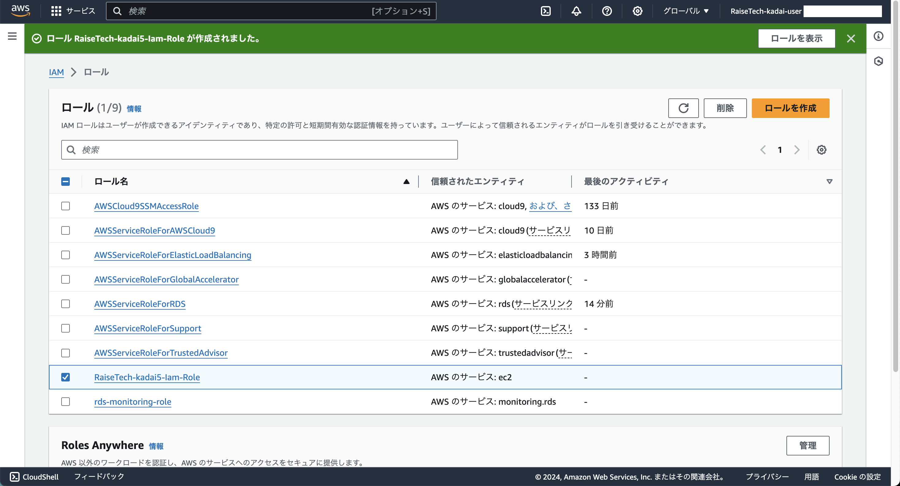

## 手順
### 1. VPC ダッシュボードへ

### 2. 左ペインから「アクセス管理」-「ロール」をクリック

### 3. 中央ペインから「ロールを作成」をクリック
  - ステップ1：信頼されたエンティティを選択
    - 信頼されたエンティティタイプ
      - AWS のサービス
    - ユースケース
      - 指定したサービスのユースケースを選択します。 サービスまたはユースケース
        - EC2
    - ユースケース
      - EC2

### 4. 「次へ」をクリック
  - ステップ2：許可を追加
    - 許可ポリシー
      - AmazonS3FullAccess
  - 許可の境界を設定 - オプション
    - 許可の境界なしでロールを作成

### 5. 「次へ」をクリック
  - ステップ3：名前、確認、および作成
    - ロールの詳細
      - ロール名
      - 説明
        - 省略
    - ステップ 1: 信頼されたエンティティを選択する
      - 編集しない
    - ステップ 2: 許可を追加する
      - 編集しない
    - ステップ 3: タグを追加する
      - **Name** タグを追加する

###  6. 「ロールを作成」をクリック
- 画像1

- 画像2

