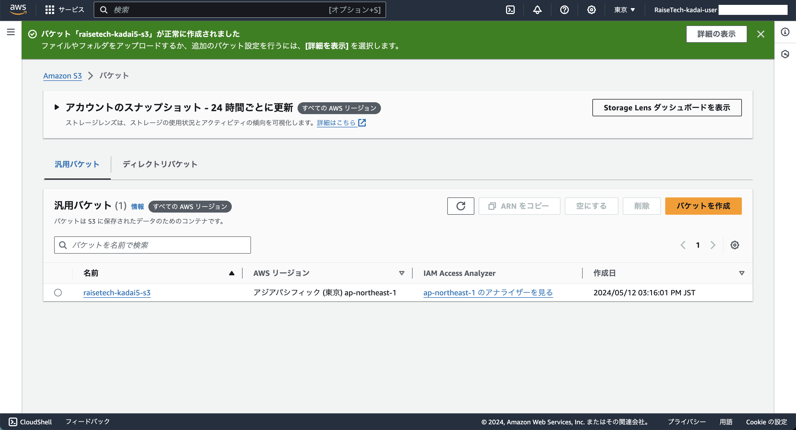
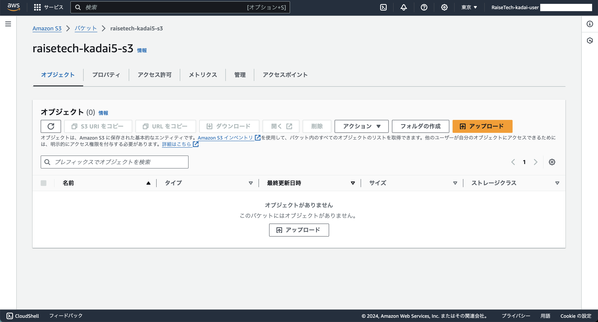

## 手順
### 1. S3 ダッシュボードへ

### 2. 中央ペインから「バケットを作成」をクリック
  - 一般的な設定
    - AWSリージョン
      - アジアパシフィック (東京) ap-northeast-1
    - バケットタイプ
      - 汎用
    - バケット名
      - **バケット名に大文字は使用できないため注意すること**
        - 省略
    - 既存のバケットから設定をコピー - オプション
      - なし
  - オブジェクト所有者 
    - ACL 無効(推奨)
    - オブジェクト所有者
      - バケット所有者の強制
  - このバケットのブロックパブリックアクセス設定
    - パブリックアクセスをすべて ブロック
      - チェックを入れる
  - バケットのバージョニング
    - バケットのバージョニング
      - 無効にする
  - タグ - オプション
    - **Name** タグを追加
  - デフォルトの暗号化
    - 暗号化タイプ
      - Amazon S3 マネージドキーを使用したサーバー側の暗号化 (SSE-S3)
  - バケットキー
    - 無効にする
  - 詳細設定
    - オブジェクトロック
      - 無効にする

### 3. 「バケットを作成」をクリック
- 画像1

- 画像2

