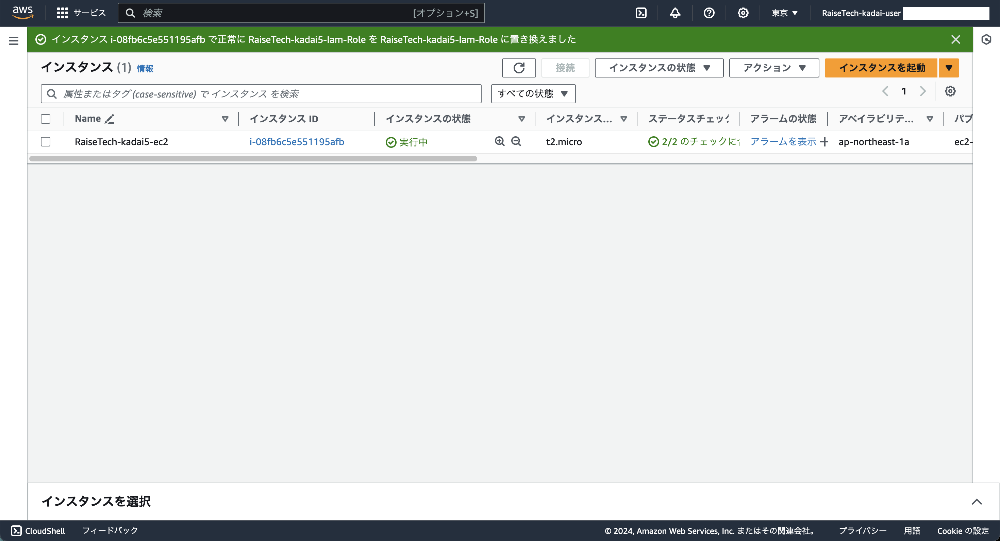
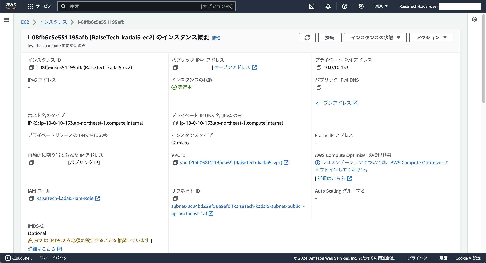
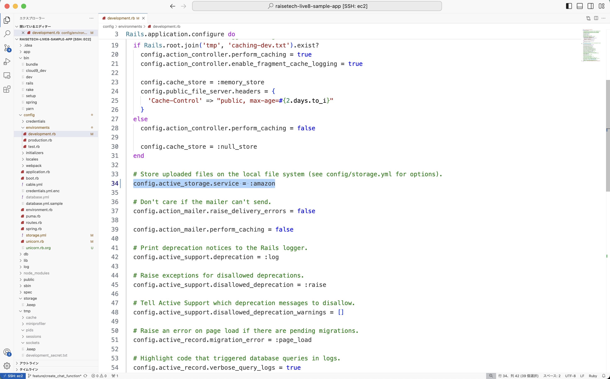
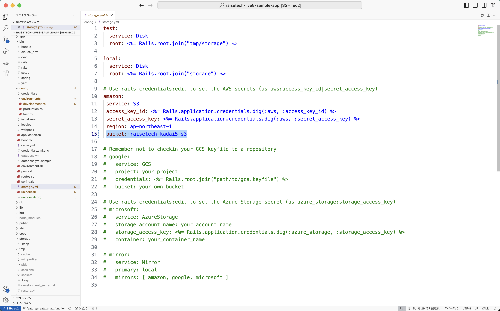

## 手順
### 1. S3 と IAMロール を作成
- **AWSコンソール** 上で以下のリソースを作成
  - S3
    - 構築した手順は [こちら](./procedure/S3.md) に記載
  - IAMロール
    - 構築した手順は [こちら](./procedure/IAMロール.md) に記載

### 2. EC2 に 作成済みのIAMロール をアタッチ
1. EC2ダッシュボードへ
2. 対象の **EC2インスタンス** をチェック
3. 中央ペインから「アクション」をクリック
4. 「セキュリティ」-「IAM ロールを変更」をクリック
    - インスタンスID
      - **作成済みのEC2インスタンス**
    - IAM ロール
      - **作成済みのIAMロール**
5. 「IAM ロールの更新」をクリック
    - 画像1
    
    - 画像2
    

### 3. 以下のファイルを修正
- EC2
  - <font color="Red">事前にアプリケーションを停止しておくこと</font>
  - development.rb
    - **34行目** を **amazon** に修正
    
  - storage.yml
    - **15行目** を **作成済みのS3バケット名** に修正
    

### 4. アプリケーションを起動
- EC2
  ```bash:title
  $ bundle exec unicorn_rails -c ./config/unicorn.rb -E development
  ```

### 5. ブラウザでアプリケーションにアクセス
- ブラウザに **http://DNS名:80** を入力
  - 保存
    - 画像1
    
    - 画像2
    
    - 画像3
    
  - 削除
    - 画像1
    
    - 画像2
    
