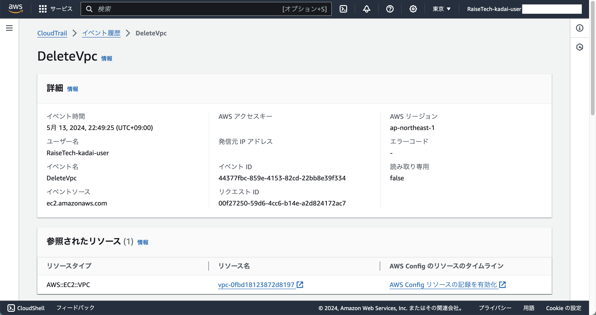
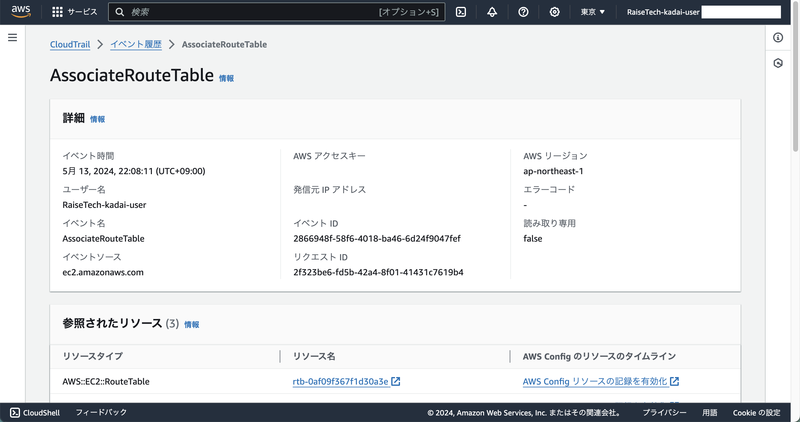
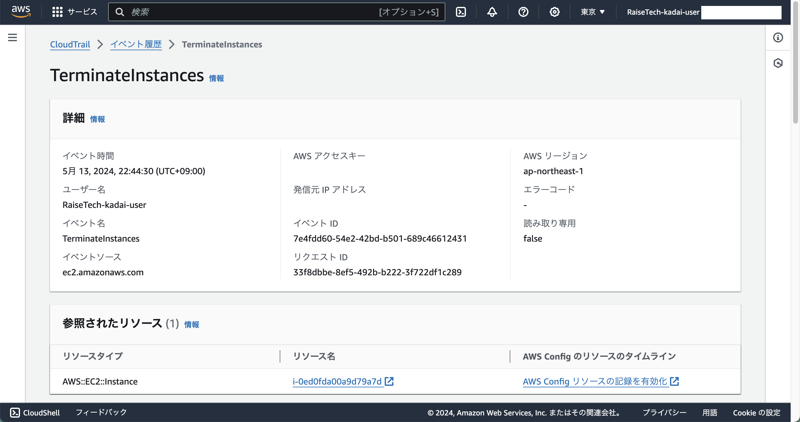
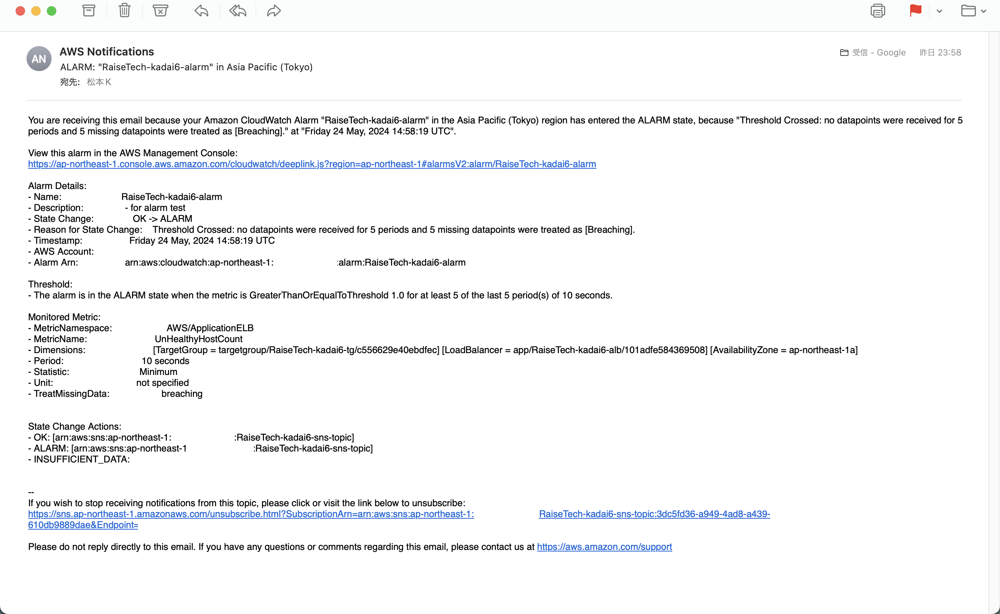
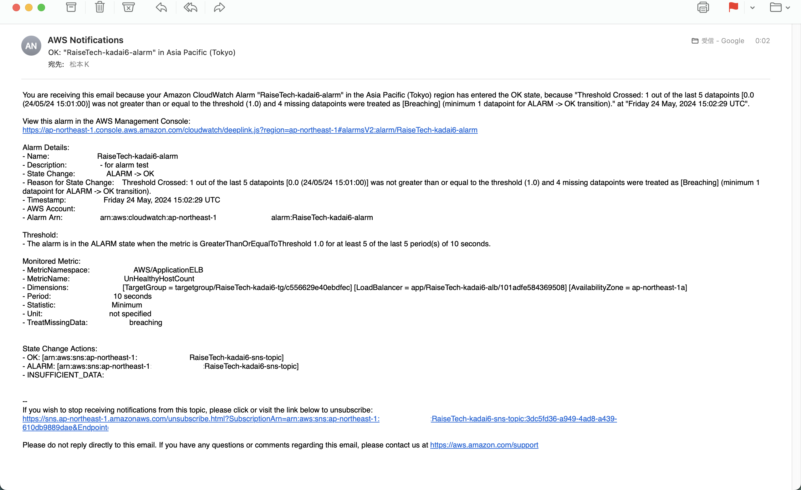
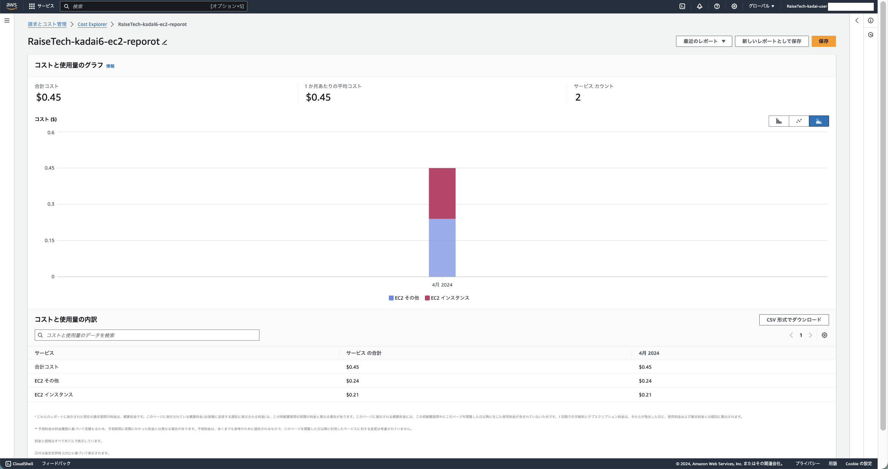

## 1. CloudTrail からイベントを抜粋
- 自分が最後に AWS を利用した日のイベントを、CloudTrail から任意に探し出す
- イベント名と含まれている内容 3 つをピックアップ
  - 自身の IAM ユーザー名が含まれるものとする
  #### ▶︎ イベント名
  1. DeleteVpc
      - VPCの削除を行なった
      
  2. AssociateRouteTable
      - ルートテーブルをサブネットに結びつけた
      
  3. TerminateInstances
      - EC2 インスタンスの削除を行なった
      

## 2. ALB のアラームを設定して、メール通知させる
- `lecture05` で作成した環境を使用すること
- メールには Amazon SNS を使用し、OK/NG アクションを設定すること
- アラームとアクションを設定した状態で、Rails アプリケーションが使える/使えない状態にして、動作確認をしてみる
  - 構築した手順は [こちら](./procedure.md) に記載
  #### ▶︎ OK の場合
  
  #### ▶︎ NG の場合
  

## 3. AWS 利用料の見積もり作成
- 見積もりは [こちら](https://calculator.aws/#/estimate?id=7d814114fba224e7ebd5608f495151dbb31b7409)

## 4. マネジメントコンソールから現在の利用料を確認
- 先月の請求情報から EC2 の料金がいくらになっているかを確認
  - 無料利用枠で収まっているかも確認すること
  #### ▶︎ 2024/04/01 - 04/30
  - Cost Explorer から
    - 69.86 円
    - 無料利用枠に収まっていない
  
