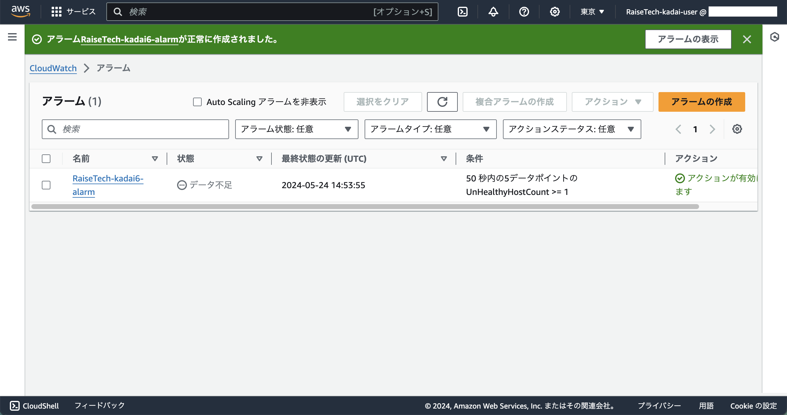
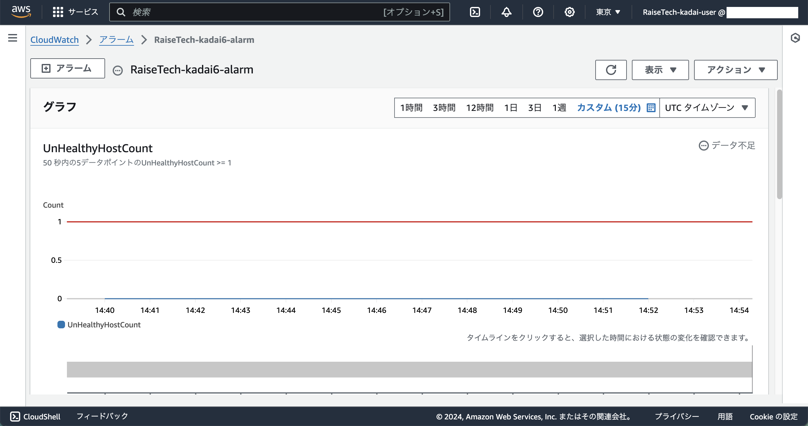

## 手順
### 1. CloudWatch ダッシュボードへ

### 2. 左ペインから 「アラーム」-「すべてのアラーム」 をクリック

### 3. 「アラームの作成」をクリック
  - ステップ1：メトリクスと条件の指定
    - メトリクス
      - グラフ
        - 省略
      - 名前空間
        - AWS/ApplicationELB
      - メトリクス名
        - UnHealthyHostCount
      - TargetGroup
      - AvailabilityZone
      - LoadBalancer
        - 省略
      - 統計
        - 最小
      - 期間
        - 10 秒
    - 条件
      - しきい値の種類
        - 静的
      - UnHealthyHostCount が次の時...
        - 以上
      - ... よりも
        - 1
      - その他の設定
        - アラームを実行するデータポイント
          - 5 / 5
        - 欠落データの処理
          - 欠落データを不正(しきい値を超えている)として処理

### 4. 「次へ」をクリック
  - ステップ2：アクションの設定
    - 通知
      - NG
        - アラーム状態トリガー
          - アラーム状態
        - 次の SNS トピックに通知を送信
          - 既存の SNS トピックを選択
            - 作成済みの SNS トピックを選択
              - SNS トピックの作成手順は [こちら](./snsトピック.md)
        - 通知の送信先:
          - 作成済みのトピックを選択
        - E メール (エンドポイント)
          - 自分のメールアドレス
      - OK
        - アラーム状態トリガー
          - OK
        - 次の SNS トピックに通知を送信
          - 既存の SNS トピックを選択
            - 作成済みの SNS トピックを選択
              - SNS トピックの作成手順は [こちら](./snsトピック.md)
        - 通知の送信先:
          - 作成済みのトピックを選択
        - E メール (エンドポイント)
          - 自分のメールアドレス
      - Lambda アクション
      - Auto Scaling アクション
      - EC2 アクション
      - Systems Manager アクション
        - 追加しない

### 5. 「次へ」をクリック
  - ステップ3：名前と説明を追加
    - アラーム名
    - アラームの説明 - オプション
      - 省略

### 6. 「次へ」をクリック
  - ステップ4：プレビューと作成
    - ステップ 1: メトリクスと条件の指定
    - 条件
    - ステップ 2: アクションの設定
    - ステップ 3: 名前と説明の追加
      - 設定した内容が正しいことを確認

### 7. 「アラームの作成」をクリック
- 画像1

- 画像2

