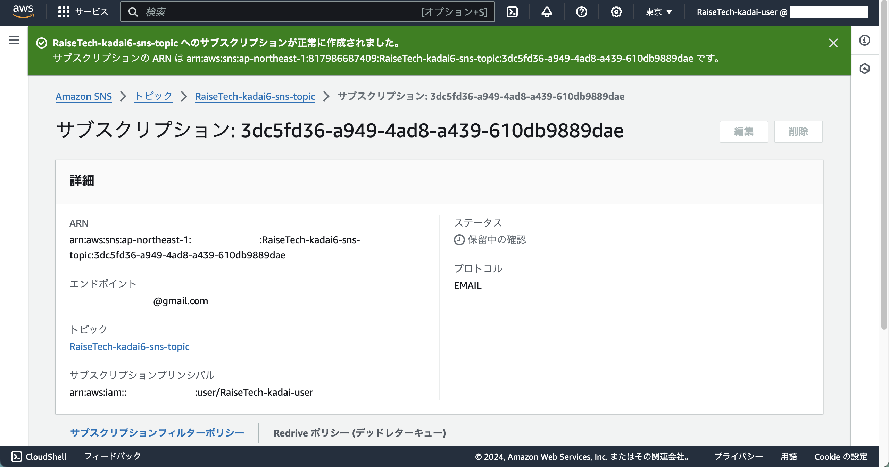
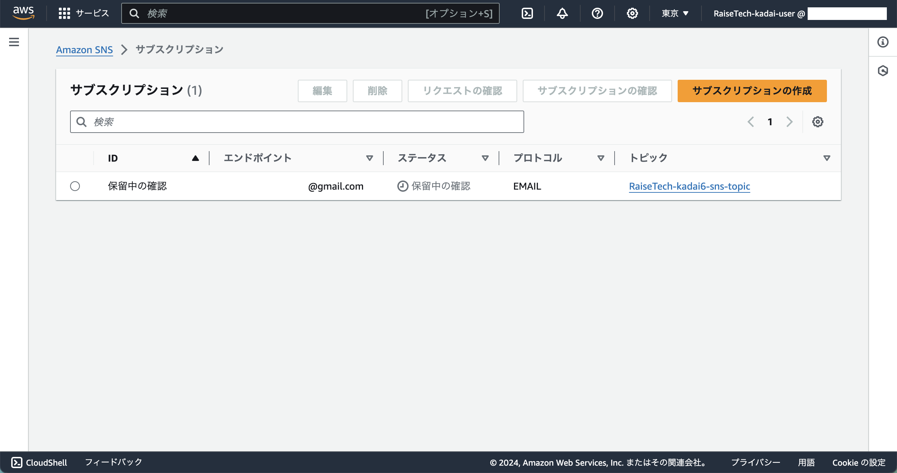
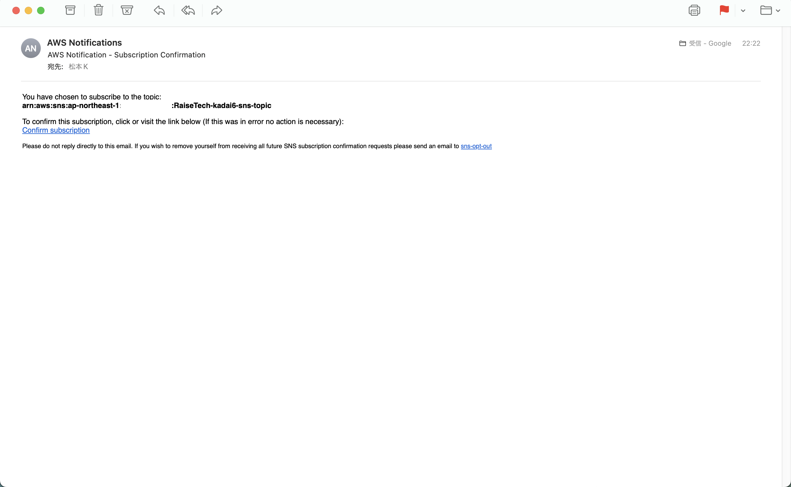
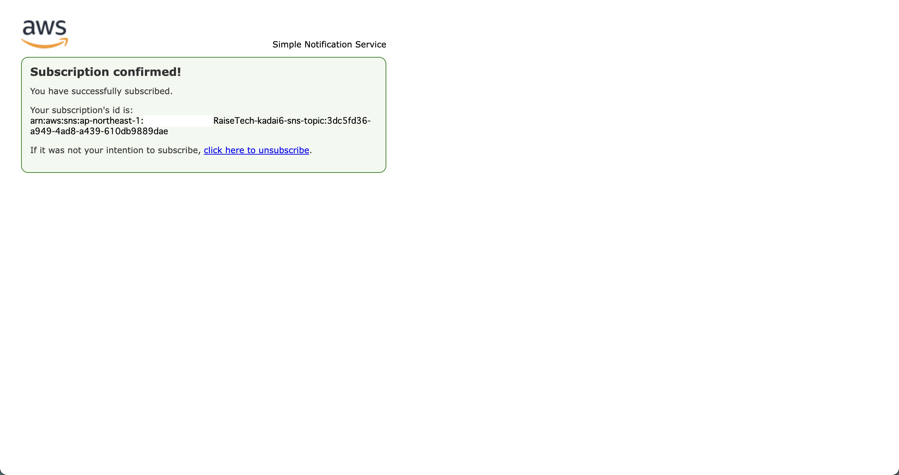
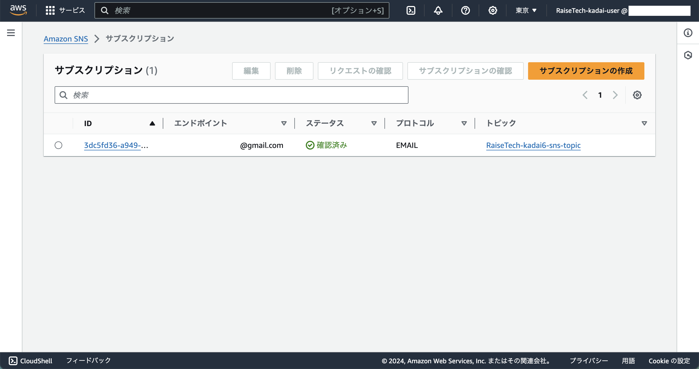

## 手順
### 1. SNS ダッシュボードへ

### 2. 左ペインから 「サブスクリプション」 をクリック

### 3. 「サブスクリプションの作成」 をクリック
  - 詳細
    - トピック ARN
      - 作成済みの SNSトピック を選択
        - SNSトピック の作成手順は [こちら](./snsトピック.md)
    - プロトコル
      - E メール
    - エンドポイント
      - 自分のメールアドレス
  - サブスクリプションフィルターポリシー - オプション 
    - サブスクリプションフィルターポリシー
      - off
  - Redrive ポリシー (デッドレターキュー) - オプション
    - Redrive ポリシー (デッドレターキュー)
      - off

### 4. 「サブスクリプションの作成」 をクリック
- 画像1

- 画像2

## 5. サブスクリプションの確認
1. `4. 「サブスクリプションの作成」 をクリック` を実施後、設定したメールアドレス宛てに以下のメールが届く

2. **Confirm subscription** をクリック

3. ブラウザで以下のページが表示されれば良い

4. ステータス欄が **確認済み** に変わる

