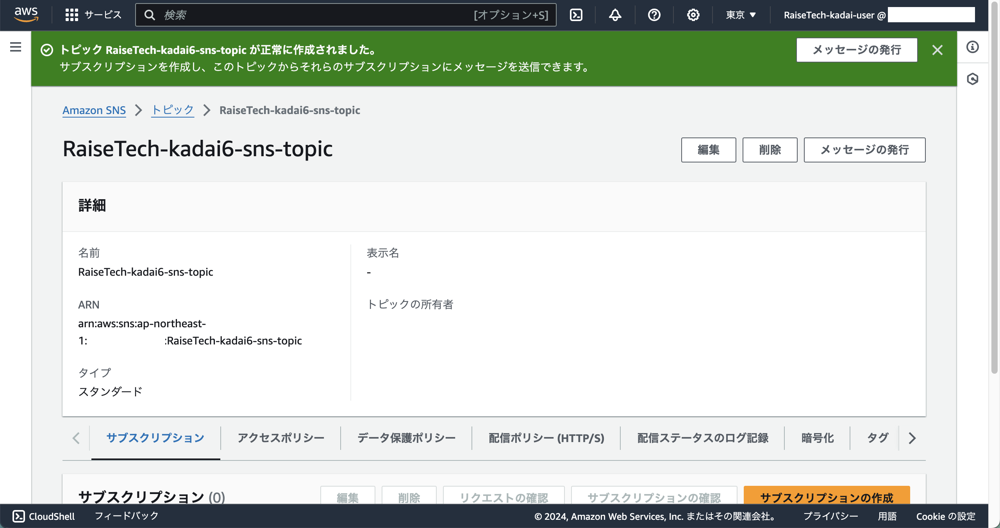
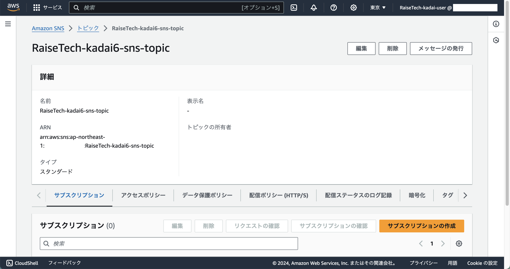

## 手順
### 1. SNS ダッシュボードへ

### 2. 左ペインから 「トピック」 をクリック

### 3. 「トピックの作成」 をクリック
  - 詳細
    - タイプ
      - スタンダード
    - 名前
      - 省略
    - 表示名 \- オプション
      - 入力しない
  - 暗号化 \- オプション
    - 暗号化
      - off
  - アクセスポリシー \- オプション
    - メソッドの選択
      - ベーシック
    - パブリッシャー
    - サブスクライバー
      - トピックの所有者のみ
  - データ保護ポリシー \- オプション
    - 設定モード
      - ベーシック
    - カスタムデータ識別子の設定 - 新規
    - 拒否設定
    - 設定を識別解除
    - 設定を監査
      - 追加しない
  - 配信ポリシー (HTTP/S) \- オプション
    - デフォルトの配信ポリシーの使用
      - チェックする
    - 再試行回数
      - 3
    - 遅延なしの再試行回数
      - 0
    - 最小遅延時間
    - 最大遅延時間
      - 20 秒
    - 最小遅延時間での再試行回数
    - 最大遅延時間での再試行回数
      - 0
    - 最大受信レート
      - \-
    - Content-Type
      - text/plain; charset=UTF-8
    - バックオフ関数の再試行
      - 線形
    - サブスクリプションポリシーの上書き
      - False
  - 配信ステータスのログ記録 \- オプション
    - これらのプロトコルの配信ステータスをログに記録します
      - チェックしない
    - 成功サンプルレート
      - 0
    - IAM ロール
      - サービスロール
        - 既存サービスロールの使用
      - 成功した配信用の IAM ロール
      - 失敗した配信用の IAM ロール
        - 入力しない
  - タグ - オプション
    - **Nameタグ** を追加
  - アクティブトレース \- オプション
    - アクティブトレースを使用しない

### 4. 「トピックの作成」 をクリック
- 画像1

- 画像2

