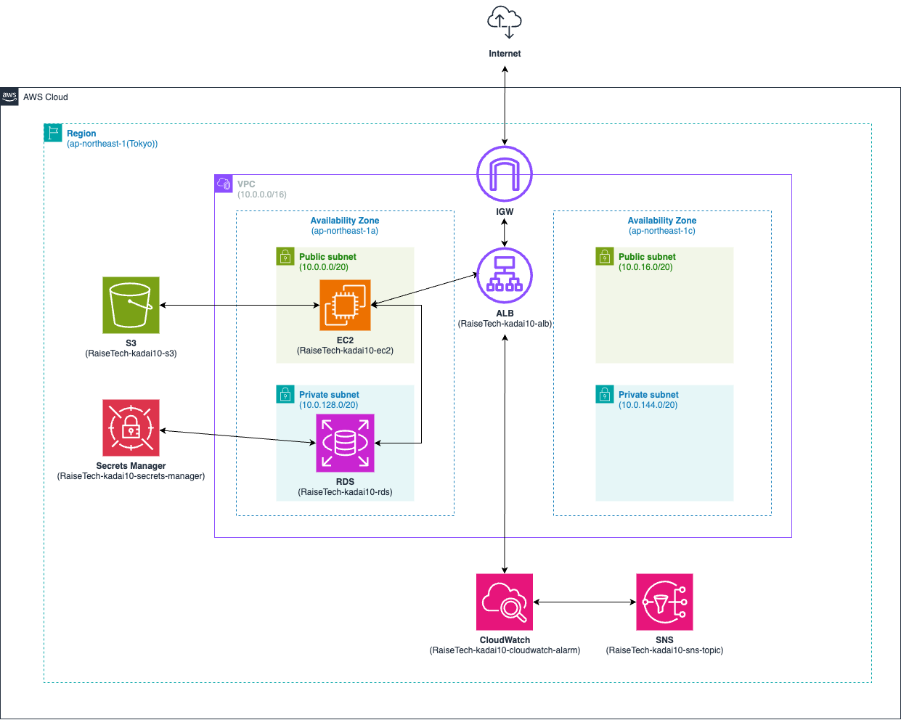

## 0. 目的
- CloudFormation を利用して、手動で作成していたリソースを自動で作成してみる
- ゴールとしては、以下の 3 点を目指す
  - アプリケーションが正常に動作している状態を確認でき、ALB 越しにアクセスができる
  - 画像の保存先が S3 になっている
  - ALBのアラームを設定して、ヘルスチェックの OK と NG の両パターンのメールが受信できる

## 1. 環境構成図


## 2. 環境構築
- CloudFormation にて、リソースを作成する
  - 構築した手順は [こちら](./procedure/cloudformation.md) に記載

  - 作成したスタック
    - スタック名
      - network
      - security
      - application
    - YAML テンプレート
      - [NetWorkLayer.yml](./cfn/NetworkLayer.yml)
      - [SecurityLayer.yml](./cfn/SecurityLayer.yml)
      - [ApplicationLayer.yml](./cfn/ApplicationLayer.yml)
  - AWS CLI にてリソースの作成結果を確認する
    - 実行するコマンド
      ```bash:title
      $ aws cloudformation describe-stacks --stack-name ${Stack-Name} --query 'Stacks[0].[StackStatus, CreationTime]' --output table
      $ aws cloudformation describe-stack-resources --stack-name ${Stack-Name} --query 'StackResources[*].[LogicalResourceId, ResourceType, ResourceStatus]' --output table
      ```
    - ログ
      - [ConstWork_20240622.log](./log/ConstWork_20240621.log)
- リソースが作成された後は、アプリケーションが動作するように各種パッケージのインストールやファイルの修正を行う
  - 今回は事前準備として、必要なパッケージが導入済みのAMIを使用している

## 3. ALB 越しにアプリケーションにアクセス
- 画像1

- 画像2


## 4. 画像の保存先が S3 になっていることを確認
- 保存
  - 画像1
  
  - 画像2
  
  - 画像3
  
- 削除
  - 画像1
  
  - 画像2
  

## 5. OKと NG の両パターンのメールを受信
- OKの場合
  - 画像1
  
  - 画像2
  
- NGの場合
  - 画像1
  
  - 画像2
  
