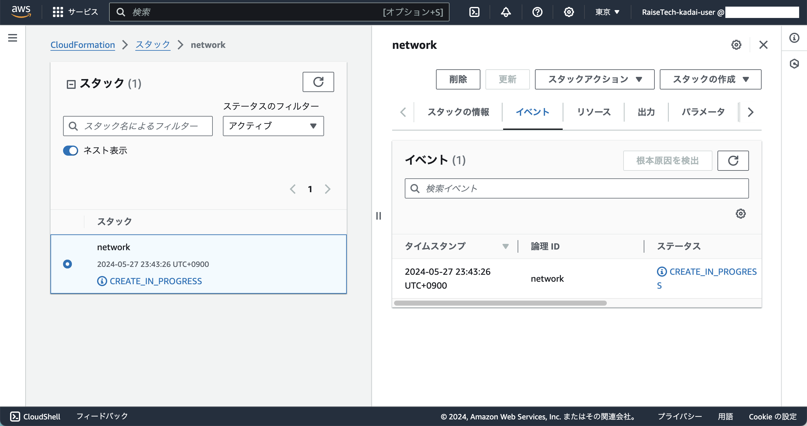
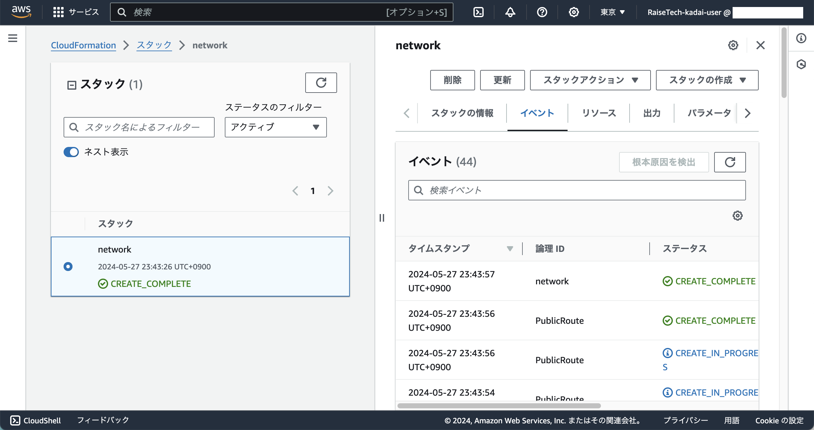

## 手順
### 1. CloudFormation ダッシュボードへ

### 2. 左ペインから 「スタック」 をクリック

### 3. 「スタックの作成」 をクリック
- ステップ1：スタックの作成
  - 前提条件 \- テンプレートの準備
    - テンプレートの準備
      - 既存のテンプレートを選択
  - テンプレートの指定
    - テンプレートソース
      - テンプレートファイルのアップロード
  - テンプレートファイルのアップロード
    - ファイルの選択
      - 作成済みのテンプレートファイルを選択
  - S3 URL:
    - 省略
      - **テンプレートファイルをアップロードすると S3 が作成される**

### 4. 「次へ」をクリック
- ステップ2：スタックの詳細を指定
  - スタック名を提供
    - **スタック名** を入力
  - パラメータ
    - Namebase
      - 省略

### 5. 「次へ」をクリック
- ステップ3：スタックオプションの設定
  - タグ - オプション
    - **Name** タグを追加
  - アクセス許可 - オプション
    - 追加しない
  - スタックの失敗オプション
    - プロビジョニング失敗時の動作
      - すべてのスタックリソースをロールバックする
    - ロールバック中に新しく作成されたリソースを削除する
      - 削除ポリシーを使用する
  - 詳細オプション
    - スタックポリシー - オプション
      - スタックポリシー
    - ロールバック設定 - オプション
      - モニタリング時間 - オプション
      - CloudWatch アラーム - オプション
        - 入力しない
      - CloudWatch アラームの ARL の追加
        - 追加しない
    - 通知オプション - オプション
      - SNS トピック ARN - オプション
        - 選択しない
      - SNS トピックを追加
        - 追加しない
      - 新しい SNS トピックの作成
        - 作成しない
    - スタックの作成オプション - オプション
      - タイムアウト
        - 入力しない
      - 削除保護
        - 非アクティブ化済み

### 6. 「次へ」をクリック
- ステップ4：確認して作成
  - ステップ1：テンプレートの指定
  - ステップ2：スタックの詳細を指定
  - ステップ3：スタックオプションの設定
    - 設定内容が正しいことを確認する
  - クイック作成リンク
    - 開かない

### 7. 「送信」をクリック
- 画像1

- 画像2

