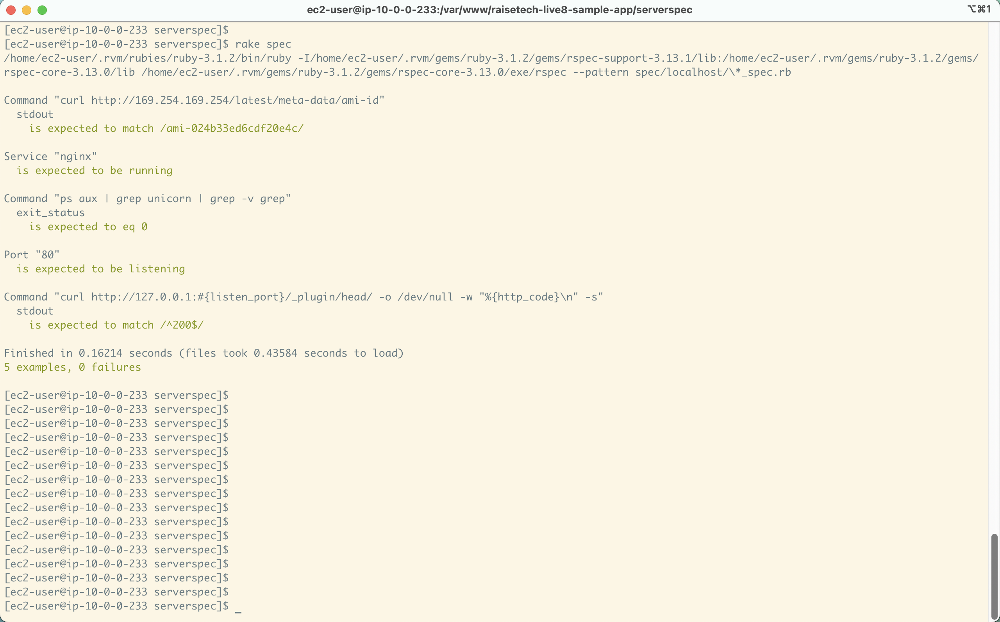

## 0. 目的
- ServerSpec を使用して、テストを成功させる
  - ご提供いただいたサンプルは [こちら](https://github.com/MasatoshiMizumoto/raisetech_documents/tree/main/aws/samples/serverspec)

## 1. 準備
- `lecture10` 環境を事前に作成しておく
  - アプリケーションを起動し、トップページが表示されることを前提とする
- ServerSpec を使用する手順は [こちら](./serverspec/procedure.md)
  - 作成したテストコードは [こちら](./serverspec/lecture11_spec.rb)

## 2. テスト実行
- 実行結果 
  - [ログ](./log/ConstWork_20240628.log)
  - 画像
  
